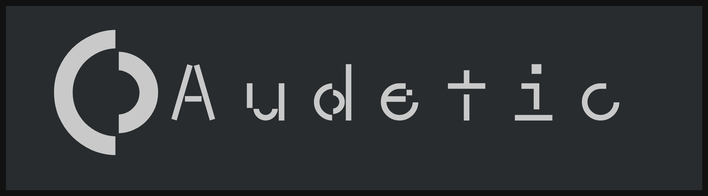

Basically superwhisper for Omarchy, Audetic is a voice to text application for Wayland/Hyprland. Press a keybind to toggle recording, get automatic transcription and inject text into the focused application/clipboard...

## Quickstart Video

[](https://youtu.be/8gQLqz_mosI)

- **[View Documentation](./docs/index.md)** - Detailed guides and configuration

## Quick Install (Recommended)

Audetic ships pre-built, signed binaries.

```bash
curl -fsSL https://install.audetic.ai/cli/latest.sh | bash
```

**After installation:**

1. Confirm the service: `audetic` - streams the logs
2. Add a keybind in Hyprland (or your compositor): `bindd = SUPER, R, Audetic, exec, curl -X POST http://127.0.0.1:3737/toggle`
3. Press the keybind to start/stop recording!

## Configuration

Default config at `~/.config/audetic/config.toml`. See [Configuration Guide](./docs/configuration.md) for details.

### Provider CLI

Audetic ships an interactive helper so you can switch transcription providers without editing TOML by hand:

```bash
audetic provider show        # inspect current provider (secrets masked)
audetic provider configure   # interactive wizard (requires a TTY)
audetic provider test        # validate the stored provider
```

## Transcribe Media Files

Transcribe audio or video files using the audetic cloud transcription service:

```bash
# Basic transcription (output to stdout)
audetic transcribe recording.mp4

# Specify language and output file
audetic transcribe meeting.mkv -l en -o meeting.txt

# JSON output with timestamps
audetic transcribe podcast.mp3 -f json --timestamps -o podcast.json

# SRT subtitle format
audetic transcribe video.mp4 -f srt -o subtitles.srt

# Copy result to clipboard
audetic transcribe voice-memo.m4a --copy

# Use custom API endpoint
audetic transcribe audio.wav --api-url http://localhost:3141/api/v1/jobs
```

**Supported formats:**

- Audio: wav, mp3, m4a, flac, ogg, opus
- Video: mp4, mkv, webm, avi, mov

Files are automatically compressed to MP3 before upload for efficient transfer.
Files already in MP3 or Opus format are sent as-is. Use `--no-compress` to skip.

**Options:**

- `-l, --language <LANG>` - Language code (e.g., 'en', 'es', or 'auto' for detection)
- `-o, --output <FILE>` - Write transcription to file (default: stdout)
- `-f, --format <FORMAT>` - Output format: text (default), json, srt
- `--timestamps` - Include timestamps in text output
- `--no-progress` - Disable progress indicator
- `-c, --copy` - Copy result to clipboard
- `--no-compress` - Skip compression (send file in original format)
- `--api-url <URL>` - Override transcription API URL

## Updates

Audetic includes an auto-updater plus manual controls:

```bash
audetic update
```

## Uninstall

```bash
curl -fsSL https://install.audetic.ai/cli/uninstall.sh | bash
```

Use `--dry-run` to preview, or `--keep-database` to preserve transcription history. See [Installation Guide](./docs/installation.md#uninstalling) for all options.

## License

MIT
