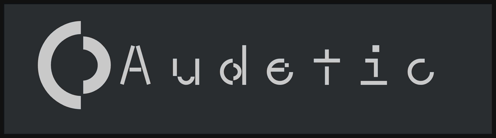

Basically superwhisper for Omarchy, Audetic is a voice to text application for Wayland/Hyprland. Press a keybind to toggle recording, get automatic transcription and inject text into the focused application/clipboard...

## Quickstart Video

[](https://youtu.be/8gQLqz_mosI)

- **[View Documentation](./docs/index.md)** - Detailed guides and configuration

## Quick Install

Audetic is built from source. Clone it and run `make install` — **never with
sudo**. Everything lives under `$HOME`.

```bash
git clone https://github.com/silvabyte/Audetic.git
cd Audetic
make install
```

`make install` detects your platform, builds in release mode, and hands off to
`audeticd install`, which registers the background service, puts the `audetic`
CLI on your PATH, waits for the daemon to bind `127.0.0.1:3737`, and opens the
web UI.

It's idempotent, so it's also the upgrade path:

```bash
git pull && make install
```

### Linux

Needs a Rust toolchain and ALSA headers (`libasound2-dev`). Copies the binary
to `~/.local/share/audetic/bin/`, installs a systemd **user** service at
`~/.config/systemd/user/audeticd.service`, and `enable --now`s it.

### macOS

Needs full Xcode plus `brew install cmake ffmpeg`, and builds an ad-hoc-signed
`Audetic.app` (the bundle is what macOS attaches Microphone / Screen Recording
permissions to). Full walkthrough, permissions, local models, and
troubleshooting: **[macOS Install Guide](./docs/macos-install.md)**.

**After installation:**

1. Finish provider and ffmpeg setup in the web UI the installer opened (or visit `http://127.0.0.1:3737/`).
2. Add a keybind:
   - Hyprland: `bindd = SUPER, R, Audetic, exec, curl -X POST http://127.0.0.1:3737/api/toggle`
   - macOS: System Settings → Keyboard → Keyboard Shortcuts → Services / Shortcuts.app calling the same `curl` command.
3. Press the keybind to start/stop recording!

## Web UI

The daemon serves a web UI at `http://127.0.0.1:3737/` for onboarding, provider
configuration, and browsing transcription history. The HTTP API lives under
`http://127.0.0.1:3737/api/*` (e.g. `POST /api/toggle`, `GET /api/status`).

## Configuration

Default config at `~/.config/audetic/config.toml`. See [Configuration Guide](./docs/configuration.md) for details.

### Provider CLI

Audetic ships an interactive helper so you can switch transcription providers without editing TOML by hand:

```bash
audetic provider show        # inspect current provider (secrets masked)
audetic provider configure   # interactive wizard (requires a TTY)
audetic provider test        # validate the stored provider
```

## Transcribe Media Files

Transcribe audio or video files using the audetic cloud transcription service:

```bash
# Basic transcription (output to stdout)
audetic transcribe recording.mp4

# Specify language and output file
audetic transcribe meeting.mkv -l en -o meeting.txt

# JSON output with timestamps
audetic transcribe podcast.mp3 -f json --timestamps -o podcast.json

# SRT subtitle format
audetic transcribe video.mp4 -f srt -o subtitles.srt

# Copy result to clipboard
audetic transcribe voice-memo.m4a --copy

# Use custom API endpoint
audetic transcribe audio.wav --api-url http://localhost:3141/api/v1/jobs
```

**Supported formats:**

- Audio: wav, mp3, m4a, flac, ogg, opus
- Video: mp4, mkv, webm, avi, mov

Files are automatically compressed to MP3 before upload for efficient transfer.
Files already in MP3 or Opus format are sent as-is. Use `--no-compress` to skip.

**Options:**

- `-l, --language <LANG>` - Language code (e.g., 'en', 'es', or 'auto' for detection)
- `-o, --output <FILE>` - Write transcription to file (default: stdout)
- `-f, --format <FORMAT>` - Output format: text (default), json, srt
- `--timestamps` - Include timestamps in text output
- `--no-progress` - Disable progress indicator
- `-c, --copy` - Copy result to clipboard
- `--no-compress` - Skip compression (send file in original format)
- `--api-url <URL>` - Override transcription API URL

## Updating

There is no auto-updater and no hosted release — rebuilding from source *is*
the update:

```bash
git pull && make install
```

## Uninstall

```bash
make uninstall
```

Stops the service and removes what `install` put on disk, after printing the
plan and asking for confirmation. Pass flags through with `ARGS`:

```bash
make uninstall ARGS="--dry-run"         # preview, change nothing
make uninstall ARGS="--keep-database"   # preserve transcription history
make uninstall ARGS="--keep-config -y"  # preserve config.toml, skip the prompt
```

See the [Installation Guide](./docs/installation.md#uninstalling) for the full
list.

## License

MIT
