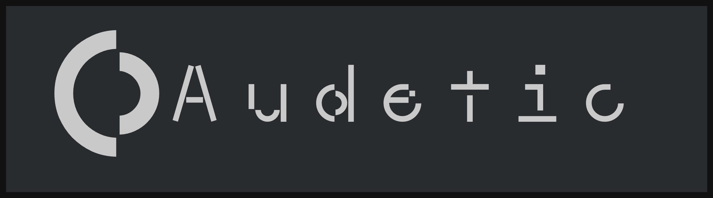

Audetic captures your thoughts, conversations, meetings, and requests as **Audio Notes**. Record from your microphone, include system audio, or import a media file. Every note appears in one chronological stream with its original transcript, AI classification, and useful generated outputs. Automatic paste into the focused application is optional and off by default.

## Quickstart Video

[](https://youtu.be/8gQLqz_mosI)

- **[View Documentation](./docs/index.md)** - Detailed guides and configuration

## Quick Install

Audetic is built from source. Clone it and run `make install` — **never with
sudo**. Everything lives under `$HOME`.

```bash
git clone https://github.com/silvabyte/Audetic.git
cd Audetic
make install
```

`make install` detects your platform, builds in release mode, and hands off to
`audeticd install`, which registers the background service, puts the `audetic`
CLI on your PATH, and waits for the daemon to bind `127.0.0.1:3737`. On Linux,
finish setup in the guided terminal flow (`audetic setup`) or the web Setup
Center (`http://127.0.0.1:3737/settings/setup`).

For ordinary upgrades:

```bash
git pull && make install
```

**Upgrading from meeting/dictation storage:** first build the new binary, stop
the old daemon, and run the explicit [Audio Notes migration](./docs/audio-notes-migration.md).
The updated daemon refuses legacy databases until conversion; the migration
creates a backup and preserves existing transcripts, titles, artifacts, and audio references.

### Linux

Needs a Rust toolchain, Bun, CMake, pkg-config, and ALSA/XKB headers. Copies the
binary to `~/.local/share/audetic/bin/`, installs a systemd **user** service at
`~/.config/systemd/user/audeticd.service`, and `enable --now`s it.

### macOS

Needs full Xcode plus `brew install cmake ffmpeg`, and builds an ad-hoc-signed
`Audetic.app` (the bundle is what macOS attaches Microphone / Screen Recording
permissions to). Full walkthrough, permissions, local models, and
troubleshooting: **[macOS Install Guide](./docs/macos-install.md)**.

**After installation:**

1. On Linux, run `audetic setup` or visit `http://127.0.0.1:3737/settings/setup` to check your transcription provider, capture tools, and shortcuts.
2. The Setup Center can install microphone-only and microphone-plus-system-audio shortcuts. Both create Audio Notes.
3. Press the configured shortcut to start/stop recording.
4. Choose your signed-in local AI agent in **Settings → Capture & delivery**. Enable automatic paste there only if you want it.

## Web UI

The daemon serves a web UI at `http://127.0.0.1:3737/` for onboarding, provider
configuration, and the unified `/audio-notes` stream. Search or filter by inferred
classification, play audio, edit titles, copy raw text, and inspect generated artifacts.
The HTTP API lives under `http://127.0.0.1:3737/api/*` (e.g.
`POST /api/audio-notes/toggle`, `GET /api/audio-notes`). OpenAPI is available at
`/api/openapi.json`. See [Audio Notes architecture and workflows](./docs/audio-notes.md).

## Configuration

Default config at `~/.config/audetic/config.toml`. See [Configuration Guide](./docs/configuration.md) for details.

### Provider CLI

Audetic ships an interactive helper so you can switch transcription providers without editing TOML by hand:

```bash
audetic provider show        # inspect current provider (secrets masked)
audetic provider configure   # interactive wizard (requires a TTY)
audetic provider test        # validate the stored provider
```

## Capture and Import from the CLI

The CLI uses the same daemon-owned pipeline and configured transcription provider as the UI:

```bash
audetic notes start                       # microphone; paste off unless configured
audetic notes stop                        # persist and transcribe
audetic notes import recording.mp4 --title "Project planning"
audetic notes list --query planning       # newest first
audetic notes show 42                     # transcript, classification, processing state
audetic notes process 42                  # retry pending/failed AI processing
audetic notes copy 42                     # explicitly copy the raw transcript
```

Use `audetic notes start --help` for system-audio, review, and per-recording
delivery options. Review supports playback and trimming before transcription.
Audio/video imports are staged durably and processed in the background; the
returned note ID can immediately be opened in the UI. The old `meeting`, `history`,
and standalone `transcribe` commands have been replaced by `notes`.

## Updating

There is no auto-updater and no hosted release — rebuilding from source *is*
the update:

```bash
git pull && make install
```

## Uninstall

```bash
make uninstall
```

Stops the service and removes what `install` put on disk, after printing the
plan and asking for confirmation. Pass flags through with `ARGS`:

```bash
make uninstall ARGS="--dry-run"         # preview, change nothing
make uninstall ARGS="--keep-database"   # preserve transcription history
make uninstall ARGS="--keep-config -y"  # preserve config.toml, skip the prompt
```

See the [Installation Guide](./docs/installation.md#uninstalling) for the full
list.

## License

MIT
